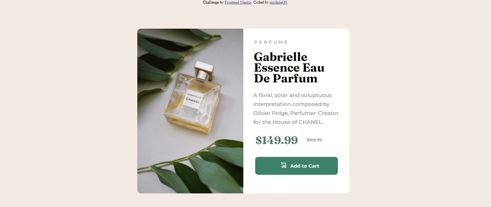

# Frontend Mentor - Product preview card component solution

This is a solution to the [Product preview card component challenge on Frontend Mentor](https://www.frontendmentor.io/challenges/product-preview-card-component-GO7UmttRfa). Frontend Mentor challenges help you improve your coding skills by building realistic projects. 

## Table of contents

- [Overview](#overview)
  - [The challenge](#the-challenge)
  - [Screenshot](#screenshot)
  - [Links](#links)
- [My process](#my-process)
  - [Built with](#built-with)
  - [What I learned](#what-i-learned)
  - [Continued development](#continued-development)
  - [Useful resources](#useful-resources)
- [Author](#author)
- [Acknowledgments](#acknowledgments)

**Note: Delete this note and update the table of contents based on what sections you keep.**

## Overview
A web design for the showcase and sale of a parfum product, this designed was built mainly with CSS Flexbox, margin, padding and position was alos used to achieve the desired spacing and positioning on the design.
### The challenge

Users should be able to:

- View the optimal layout depending on their device's screen size
- See hover and focus states for interactive elements

### Screenshot

 

**Check screenshot folder for screenshot of the design.**

### Links

- Solution URL: [Add solution URL here](https://your-solution-url.com)
- Live Site URL: [Add live site URL here](https://your-live-site-url.com)

## My process
The process of building this site started with adding the necessary div elements to create containers to make the use of flexbox easy and achievable.
The Challenge was to build parfum catalogue design for desktop 1440px and mobile of 375px, I started the building for desktop first and later added media queries for the mobile of 375px.
Apart for the use of Flexbox and Media Queries nothing beyond the usual(Margin, Padding, Position, Font, etc.) was used in the building of this site. 

### Built with
- Semantic HTML5 markup
- CSS custom properties
- Flexbox

### What I learned
I can't say i learned something necessarily new in the building of this design, but practice makes perfect, hence if i were to say i learned anything new it would be that i am one step closer in becoming perfect in the use of every elements that was used in this design. Hence i am grateful that i completed this project. 

### Continued development
Going forward, I think i am going to be looking into more resposives builds as to continue to develop my skills in Media Queries and Flexbox but more in particular Media Queries as i enjoyed them although still frustrating to use i still enjoyed using them either way. 

### Useful resources
Some of the usefull resouces or websites that really helped me in the building of project include: 
- [Resource 1](https://www.w3schools.com/css/) - This site on on all aspects of the design as i looked up this site alot during the build of this design. I really liked this pattern and will use it going forward.
- [Resource 2](https://www.https://wpbuffs.com/media-query-for-mobile/.com) - This is an amazing article which helped me in understanding Media Queries. I'd recommend it to anyone still learning this concept.

## Author
- Frontend Mentor - [@modade97](https://www.frontendmentor.io/profile/modade97)
- Twitter - [@modadegospel](https://www.twitter.com/modadegospel)

